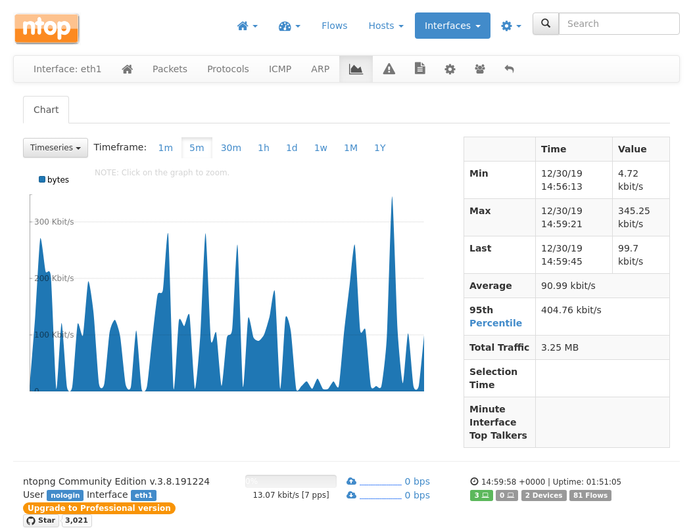

# `ansible-project-dumbhub`

> This is a Work-in-Progress project.

Create a `dumbhub` that you can place between your router and the peer device
of ISP. The hub acts as L2 switch, simply forwards all packets from one
interface to another. However, the hub also runs `ntopng` and other network
monitoring tools, providing a user interface of network status, including
packets per sec, protocol breakdown, and a list of _top takers_ in the
network.

The project is managed by `ansible` and several my `ansible` roles, which
means that the device configuration can be tested in deterministic way in
a virtualised environment, and you can deploy with a single command on a plain
default installation from scratch.

The project has a set of tests that you can perform on virtual machine, or
a machine in production.

## Use cases

You would like to monitor a network so that you can find _bandwidth eaters_ in
the network, or so that you can see trend of bandwidth. But your router is a
consumer product without advanced monitoring features. You would like to see
trends, top talkers, protocols, etc.

You would like to monitor traffic, but you cannot modify router
configuration nor network topology.

## Features

* [x] [`ntopng`](https://www.ntop.org/products/traffic-analysis/ntop/) which
  provides nice user interface
* [x] [`argus`](https://openargus.org/) which analyzes packet flows,
  optionally export flow information to remote client
* [x] [`net-snmp`](http://www.net-snmp.org/) which exports interface metrics
* [x] [`dumpcap`](https://www.wireshark.org/docs/man-pages/dumpcap.html) which
  saves packets in `pcap` format
* [x] [`squid`] which provides HTTP proxy

## Screenshots

### `ntopng`



See more screenshots of `ntopng` at [the product page](https://www.ntop.org/products/traffic-analysis/ntop/).

### `argus`


## Deployment patterns

Depending on your constraints, there are different deployment patterns. Choose
the one that suits to your needs.

### Peer - dumbhub - Router (NAT)

```
.----------.   .---------.   .--------.
| ISP peer |---| dumbhub |---| Router |---> Internal network
`----------'   `---------'   `--------'
                    |             |
                    `-----WiFi----'
```

In this pattern, the router performs NAT. For whatever reason, you cannot
change network topology or router configuration. The WiFi interface is used
for accessing to the user interface.

Pros:

* You do not have to change any configuration of the router
* When the `dumbhub` fails, simply remove the `dumbhub`, and connect the
  router to ISP peer. Everything should work as before.

Cons:

* As the router rewrites all source address of packets, the `dumbhub` cannot
  see the real source of packets. All traffic seems to come from a single
  source. No MAC address information, too (other than one of the router).

### Peer - dumbhub (NAT) - Router

```
.----------.   .---------.   .--------.
| ISP peer |---| dumbhub |---| Router |---> Internal network
`----------'   `---------'   `--------'
```

In this pattern, the `dumbhub` performs NAT. WiFi interface is optional.

Pros:

* You have full access to packet information, including MAC and IP address.
* WiFi interface is optional as the `dumbhub` has internal IP address.

Cons:

* The network topology must be changed: the router must not perform NAT.
* When the `dumbhub` fails, you need another `dumbhub` for backup and replace
  the failed one with the backup. Configurations must be identical and always
  in sync.
* When the `dumbhub` fails, and you do not have a backup `dumbhub`, you need
  to re-configure the router setting, including NAT, and WAN interface
  configuration, which means longer downtime.
* In addition to packet analysing, the `dumbhub` uses more CPU and RAM for NAT,
  which may require more powerful hardware.

### Peer - Router (NAT) - dumbhub

```
.----------.   .--------.   .---------.   .-------------------.
| ISP peer |---| Router |---| dumbhub |---| L2 switch/WiFi AP |---> Internal network
`----------'   `--------'   `---------'   `-------------------'
                                 |                  |
                                 `------WiFi--------'
```

In this pattern, the router performs NAT. The `dumbhub` acts as L2 switch.

Pros:

* The network topology may be intact
* You have full access to packet information, including MAC and IP address.
* When the `dumbhub` fails, simply remove the `dumbhub`, and connect the L2
  switch, or WiFi AP, to the router, which means shorter downtime.

Cons:

* You need additional L2 switch or WiFi AP, which is another failure point
* As all clients use the other WiFi AP, WiFi interface of the router is not
  used at all.

## Requirements

* A machine with two ethernet ports, and WiFi interface (or three ethernet
  ports). The WiFi interface can be optional (see Deployment patterns).

### Requirements on target machine

* OS is Ubumtu 18.04 or its variants
* Configured WiFi network interface
* Configured `sshd`
* A Unix account that can run `sudo(1)` as root
* `python`

## Environments

The project provides two environments. One for development and tests, and
another for production system.

`virtualbox` environment is used for development, where `virtualbox` VM is
launched and provisioned.

`prod` is for production system. It can be VMs on cloud service, or a physical
machine.

### Inventory

TBW

## Usage

Clone the repository.

```
git clone https://github.com/trombik/ansible-project-openhab
cd ansible-project-openhab
```

Setup `bundler`.

```
bundle install --path=~/.vendor/bundle
```

Replace `~/.vendor/bundle` with your directory to install gems.

The project is managed by a `Rakefile`. It provides targets to launch virtual
machines, provision them, and test the configured system.

Launch the VM.

```
bundle exec rake up
```

Provision the VM.

```
bundle exec rake provision
```

Test the system.

```
bundle exec rake test:serverspec:all
```

Login to the system (only for `virtualbox` environment).

```
vagrant ssh hab.i.trombik.org
```

Destroy the VM.

```
bundle exec rake clean
```

### Environment variables

#### HTTP proxy

The `Rakefile` supports proxy on local machine. It assumes that the proxy is
running on local machine, listening on port 8080. If it detects the port is
open, then, automatically set necessary proxy setting during the deployment,
which makes the process faster. Any HTTP proxy application works. Here I use
`polipo`.

```
polipo logFile= daemonise=false diskCacheRoot=~/tmp/cache allowedClients='0.0.0.0/0' proxyAddress='0.0.0.0' logSyslog=false logLevel=0xff proxyPort=8080 relaxTransparency=true
```

If you use other application on that port, `VAGRANT_HTTP_PROXY_PORT`
environment variable can be defined to override port 8080. Replace
`~/tmp/cache` with your cache directory.

#### Switching environment

`ANSIBLE_ENVIRONMENT` is an environment variable to switch the target
environment. If not defined, `virtualbox`, where you develop the system, is
assumed. Another environment is `prod`, which is the live production system.

To deploy to `prod`, run:

```
ANSIBLE_ENVIRONMENT=prod bundle exec rake provision
```

#### User to deploy

By default, user `vagrant` for `virtualbox` environment, and the Unix account
on the local machine, is used as `ssh` account. To override it, use
`ANSIBLE_USER` environment variable.

#### `ansible-vault`

To decrypt password protected files by `ansible-vault`, the `Rakefile` use
`ANSIBLE_VAULT_PASSWORD_FILE` environment variable. It should be path to
`ansible-vault` password file on local machine.

#### User to run specs

To test the system in `prod` environment, `SUDO_PASSWORD` environment variable
must be set, which is used to run specs on the target machine. Your local Unix
account (or `ANSIBLE_USER` account) must be able to run `sudo(1)` on the
target machine.
